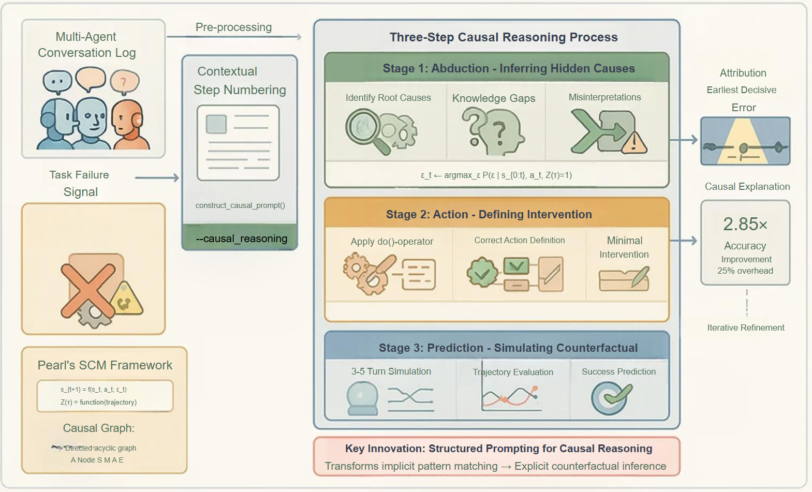

# A2P: Abduct-Act-Predict Scaffolding for Automated Failure Attribution in Multi-Agent Systems

## 🎯 Overview

<div align="center">
    
</div>

This repository implements the **A2P (Abduct-Act-Predict) Scaffolding** framework - a novel approach that transforms failure attribution in multi-agent systems from pattern recognition into structured causal inference. A2P achieves **2.85×** improvement over baseline methods by guiding large language models through a formal three-step reasoning process within a single inference pass.

## 🚀 Key Features

- **Revolutionary Performance**: 47.46% step-level accuracy on algorithm-generated systems (2.85× improvement over baseline)
- **Robust Causal Reasoning**: Systematic counterfactual inference through Abduction, Action, and Prediction steps
- **Production-Ready**: Backward-compatible implementation with only 25% processing overhead
- **Comprehensive Evaluation**: Validated on 184 real-world multi-agent system failures

## 🔬 A2P Scaffolding Framework

The A2P framework reframes failure attribution as a structured causal inference task:

### 1. **Abduction** - Infer Hidden Root Causes
- Identify knowledge gaps, misinterpretations, or flawed assumptions
- Infer latent variables explaining agent behavior
- Determine the most plausible root cause of failure

### 2. **Action** - Define Minimal Corrective Intervention
- Specify exactly what the agent should have done instead
- Define concrete, minimal interventions addressing root causes
- Operationalize the $do()$-operator from causal calculus

### 3. **Prediction** - Simulate Counterfactual Trajectory
- Predict 3-5 subsequent conversational turns under correction
- Test whether intervention would lead to task success
- Trace causal chains: intervention → intermediate effects → final outcome

## 📦 Installation

### Prerequisites
- Python 3.8+
- PyTorch (for local models)
- Access to OpenAI API or local LLM endpoints

### Install Dependencies
```bash
pip install -r requirements.txt
```

### Environment Setup
For GPT models, configure your API credentials:
```bash
export AZURE_OPENAI_API_KEY="your-api-key"
export AZURE_OPENAI_ENDPOINT="your-endpoint"
```

## 🏃‍♂️ Quick Start

### Basic Usage with A2P Scaffolding

Run failure attribution with A2P enhancement:
```bash
python Automated_FA/inference.py \
    --method all_at_once \
    --model gpt-oss-120b \
    --a2p \
    --directory_path "Who&When/Algorithm-Generated" \
    --is_handcrafted False
```

### Supported Models

| Model Family | Models | Command Flag |
|-------------|---------|--------------|
| **GPT** | GPT-4o, GPT-4, GPT-4o-mini | `--model gpt-4o` |
| **Local GPT-OSS** | gpt-oss-120b (default) | `--model gpt-oss-120b` |
| **Llama** | 8B, 70B Instruct | `--model llama-8b` |
| **Qwen** | 7B, 72B Instruct | `--model qwen-7b` |
| **DeepSeek** | DeepSeek Reasoner | `--model deepseek` |

### Key Arguments

- `--a2p`: Enable A2P scaffolding framework (recommended)
- `--use_async`: Enable async batch processing for better throughput
- `--batch_size 48`: Number of concurrent API requests
- `--max_tokens 20000`: Maximum tokens for response

## 🔍 Evaluation

### Run Evaluation
```bash
python Automated_FA/evaluate.py \
    --data_path "Who&When/Algorithm-Generated" \
    --eval_file "outputs/all_at_once_gpt-oss-120b_a2p_alg_generated.txt"
```

### Performance Metrics
- **Agent-Level Accuracy**: Percentage of correctly identified failure-responsible agents
- **Step-Level Accuracy**: Percentage of correctly identified decisive error steps

## 📊 Experimental Results

### A2P vs. Baseline Methods

| Method | Algorithm-Generated | Hand-Crafted |
|--------|-------------------|--------------|
| **A2P (Ours)** | **47.46%** | **29.31%** |
| All-at-Once | 16.67% | 12.07% |
| Step-by-Step | 27.78% | 18.97% |
| Binary Search | 28.57% | 13.79% |

**Key Findings:**
- **2.85× improvement** on Algorithm-Generated dataset
- **2.43× improvement** on Hand-Crafted dataset
- Robust performance across varying conversation lengths (up to 130+ steps)

## 🛠️ Advanced Usage

### Async Batch Processing
For large-scale evaluation with better throughput:
```bash
python Automated_FA/inference.py \
    --method all_at_once \
    --model gpt-oss-120b \
    --a2p \
    --use_async \
    --batch_size 48 \
    --directory_path "Who&When/Hand-Crafted" \
    --is_handcrafted True
```

### Compare Methods
Run ablation studies comparing A2P with baseline:
```bash
# Baseline
python Automated_FA/inference.py --method all_at_once --model gpt-oss-120b --directory_path "Who&When/Algorithm-Generated" --is_handcrafted False

# A2P Enhanced
python Automated_FA/inference.py --method all_at_once --model gpt-oss-120b --a2p --directory_path "Who&When/Algorithm-Generated" --is_handcrafted False
```

## 🏗️ Architecture

### Core Components

- **`Automated_FA/inference.py`**: Main entry point with A2P integration
- **`Automated_FA/Lib/utils.py`**: A2P prompt construction and synchronous processing
- **`Automated_FA/Lib/async_utils.py`**: Async batch processing with A2P support
- **`Automated_FA/Lib/local_model.py`**: Local model implementations
- **`Automated_FA/evaluate.py`**: Performance evaluation metrics

### A2P Implementation Details

The A2P framework is implemented through:
1. **Enhanced Prompt Construction**: `construct_a2p_prompt()` function
2. **Contextual Step Numbering**: Explicit `Step {idx} - Agent_Name:` formatting
3. **Structured Reasoning**: Three-step causal analysis within single inference pass

## 🗄️ Dataset: Who&When Benchmark

The Who&When benchmark provides 184 annotated failure cases:

- **Algorithm-Generated** (126 samples): From CaptainAgent systems
- **Hand-Crafted** (58 samples): From Magnetic-One systems

Each case includes:
- Multi-agent conversation history
- Ground truth failure attribution (agent + step)
- Natural language failure explanation
- System prompts and task descriptions

> **Access Dataset**: [HuggingFace 🤗](https://huggingface.co/datasets/Kevin355/Who_and_When)

## 🎓 Research Impact

### Novel Contributions

1. **Methodological Innovation**: First framework to apply structured causal inference to failure attribution
2. **Empirical Excellence**: State-of-the-art performance with significant improvements over baselines
3. **Practical Utility**: Production-ready implementation with minimal computational overhead
4. **Theoretical Foundation**: Operationalizes Pearl's causal hierarchy for LLM reasoning

### Applications

- **System Debugging**: Automated identification of failure-responsible components
- **Development Acceleration**: Faster iteration cycles through precise error localization  
- **Self-Improving Agents**: Actionable feedback for agent self-correction
- **Quality Assurance**: Systematic analysis of multi-agent system reliability

## 📄 License

This project is licensed under the MIT License - see the [LICENSE](LICENSE) file for details.

## 🙏 Citation

If you find this work useful, please cite our paper:

```bibtex
@article{zhang2025a2p,
  title={Abduct, Act, Predict: Scaffolding Causal Inference for Automated Failure Attribution in Multi-Agent Systems},
  author={West, Alva and Weng, Yixuan and Zhu, Minjun and Lin, Zhen and Zhang, Yue},
  journal={arXiv preprint arXiv:2505.00212},
  year={2025}
}
```

## 🤝 Contributing

We welcome contributions! Please feel free to submit issues, feature requests, or pull requests.

## 📧 Contact

For questions or collaborations, please contact:
- **Yue Zhang**: [zhangyue@westlake.edu.cn](mailto:zhangyue@westlake.edu.cn)

---

**🌟 If you find this project helpful, please consider giving us a star! It motivates us to keep improving.**